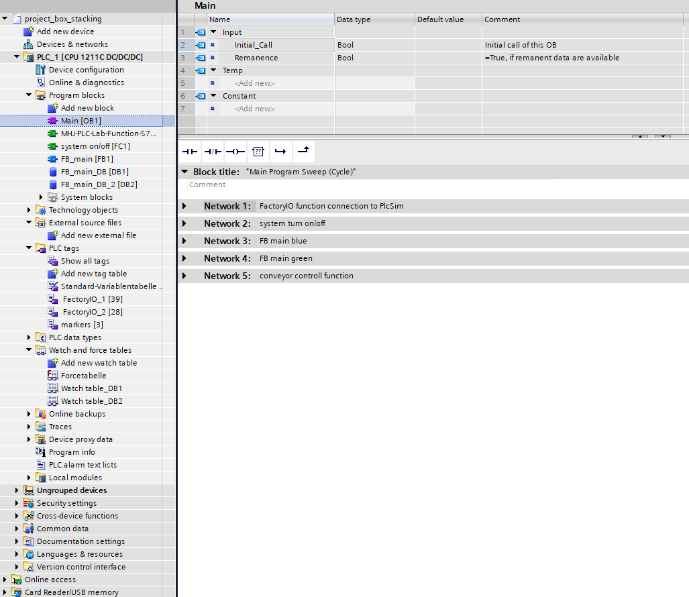

# SmartStacker: Integracja TIA Portal z Factory IO dla Zautomatyzowanych Systemów Produkcyjnych

## O Projekcie

SmartStacker to edukacyjny projekt do symulacji i kontroli zautomatyzowanej linii produkcyjnej. Projekt skupia się na nauczaniu programowania PLC poprzez praktyczne doświadczenie z systemem sortowania opartym na kolorach oraz  łączenia komponentów na taśmociągu.

## Cele Projektu

- **Edukacja:**  nauka programowania PLC na programie symulacyjnym i zrozumienia jego aplikacji w realnych scenariuszach przemysłowych.
- **Symulacja:** Demonstracja możliwości symulacji zautomatyzowanej linii produkcyjnej, w tym sortowania i wykrywania  produktów.

## Technologie i Narzędzia

Projekt wykorzystuje następujące technologie i narzędzia:
- TIA Portal
- Factory IO
- Simatic S7 PLCSIM

## Drzewo Projekt , main OB1

