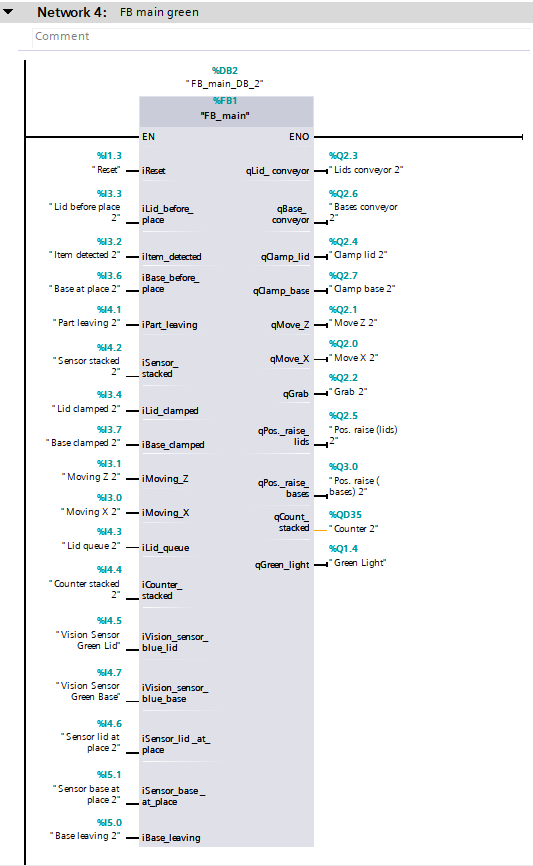
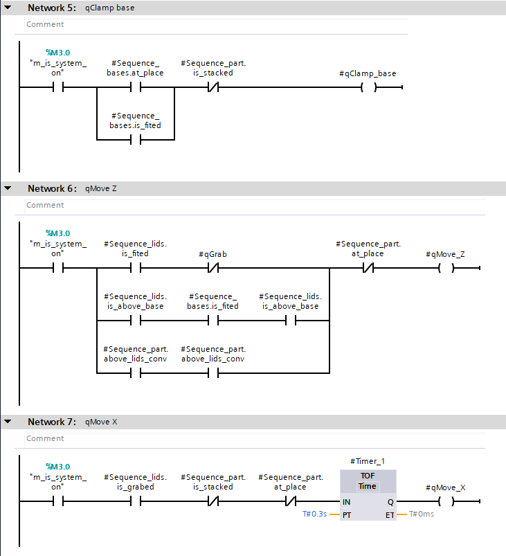
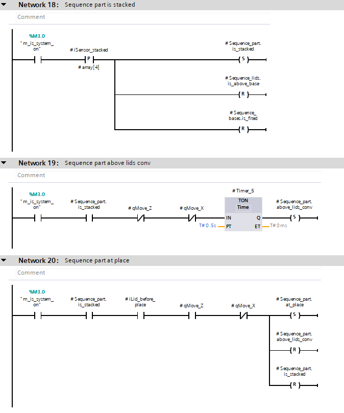
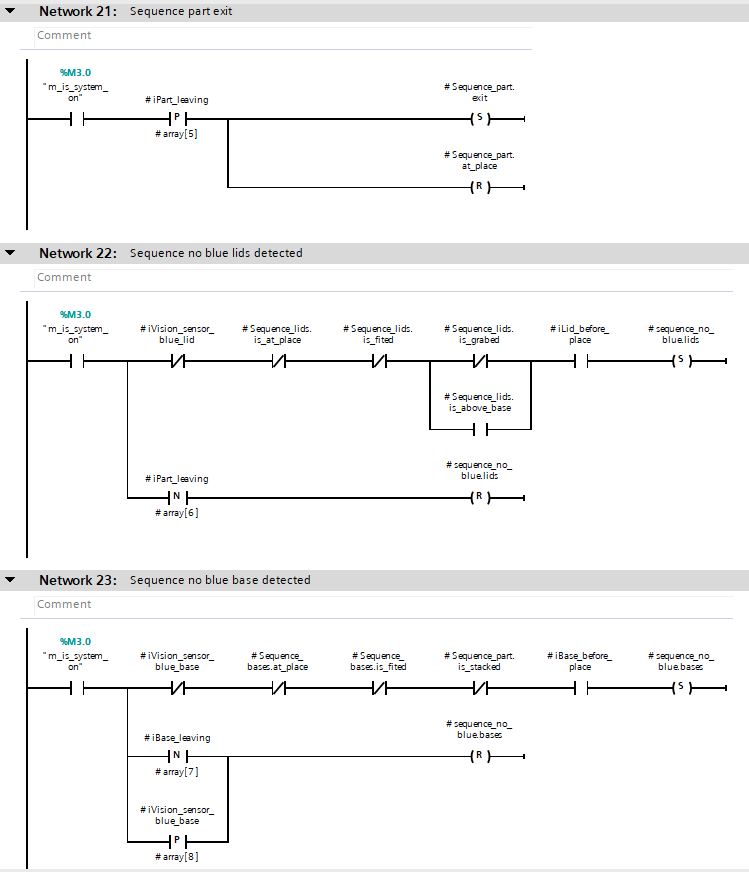
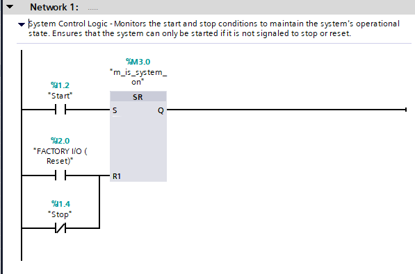

# SmartStacker: Integracja TIA Portal z Factory IO dla Zautomatyzowanych Systemów Produkcyjnych

## O Projekcie

SmartStacker to edukacyjny projekt do symulacji i kontroli zautomatyzowanej linii produkcyjnej. Projekt skupia się na nauczaniu programowania PLC poprzez praktyczne doświadczenie ze środowiskiem TIA Portal wraz z symulatorem sterownika.

## Cele Projektu

- **Edukacja:**  nauka programowania PLC na programie symulacyjnym i zrozumienia jego aplikacji w realnych scenariuszach przemysłowych.
- **Symulacja:** Demonstracja możliwości symulacji zautomatyzowanej linii produkcyjnej, w tym sortowania i wykrywania  produktów.

## Technologie i Narzędzia

Projekt wykorzystuje następujące technologie i narzędzia:
- TIA Portal
- Factory IO
- Simatic S7 PLCSIM S7-1200

## Funkcjonalność i Opis Działania 
Składa się ona z dwóch głównych taśmociągów, na których umieszczono dwa stanowiska montażowe do składania pudełek. Każde z tych stanowisk wyposażone jest w:
- Robot Montażowy
- Bramę Przesuwną
- Siłownik Wyrównujący Pudełka
- Czujniki Położenia
- Kamera Wizyjna

## Sekwencje Sterowania
### Sekwencje Pokryw
- `Sequence_lids_at_place` - Wskazuje, czy pokrywy znajdują się na wyznaczonym miejscu.
- `Sequence_lids_is_fitted` - Określa, czy pokrywy zostały właściwie dopasowane.
- `Sequence_lids_is_grabbed` - Monitoruje, czy pokrywy zostały chwyczone przez roboty montażowe.
- `Sequence_lids_above_base` - Sygnalizuje, że pokrywy znajdują się bezpośrednio nad podstawami.

### Sekwencje Podstaw
- `Sequence_bases_at_place` - Wskazuje, czy podstawy są na swoich miejscach w strefie montażu.
- `Sequence_bases_is_fitted` - Określa, czy podstawy zostały prawidłowo zamontowane.

### Sekwencje Części
- `Sequence_part_is_stacked` - Sygnalizuje, że części zostały poprawnie ułożone w stos.
- `Sequence_part_above_lids` - Wskazuje, czy części znajdują się nad pokrywami.
- `Sequence_part_at_place` - Monitoruje, czy części znajdują się na wyznaczonym miejscu.
- `Sequence_part_exit` - Informuje, że część opuściła strefę montażową.

### Sekwencje Braku Niebieskich Elementów
- `Sequence_no_blue_lids` - Określa, czy w procesie nie występują niebieskie pokrywy.
- `Sequence_no_blue_bases` - Sygnalizuje brak niebieskich podstaw w procesie.
- 
### Wykorzystanie funkcji Fb do 2 stanowisk 
Blok DB1 jest przypisyany do 1 stanowiska , Blok DB2 do drugiego

## Demo Wideo

## Drzewo Projektu , Main OB1

## Main OB1 networks

## Main FB1 networks 

### DB1 watch table

### DB2 watch table

## FC system on/off

### PLC Tags

